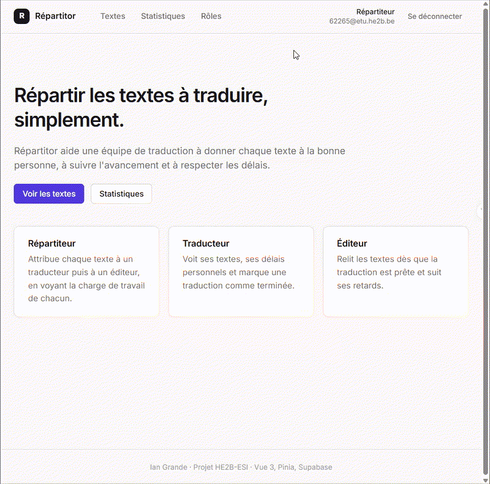
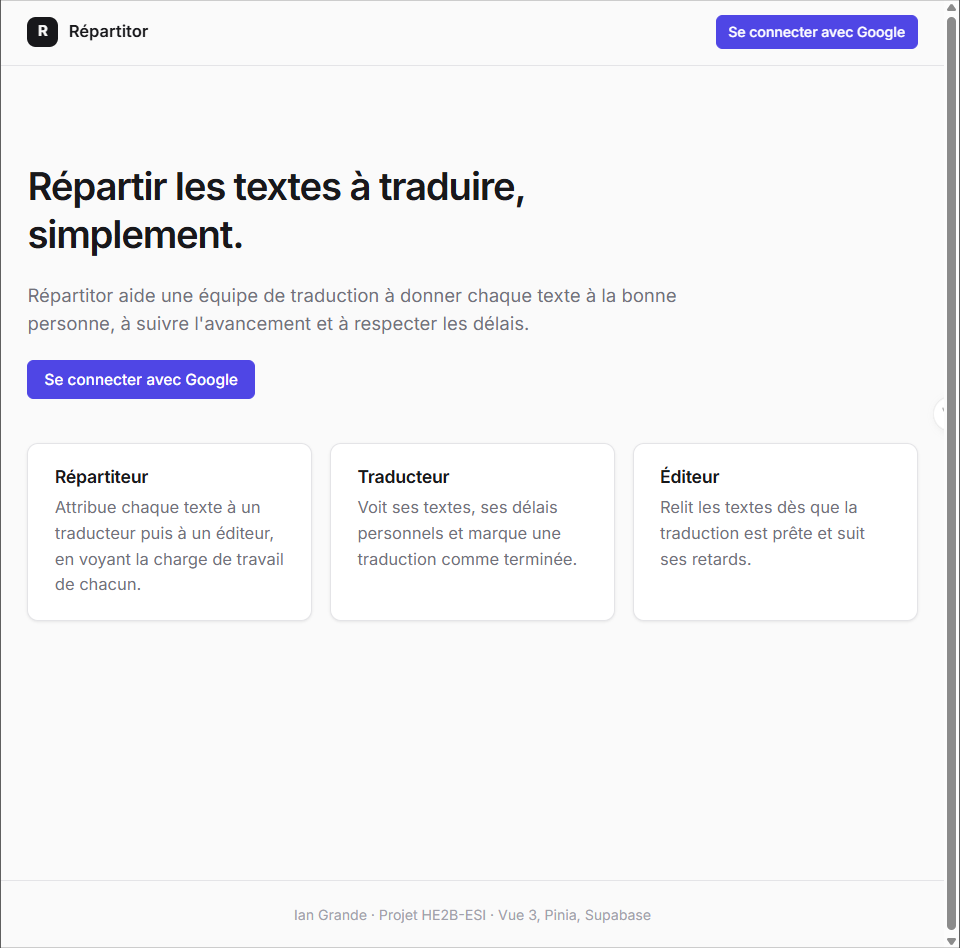
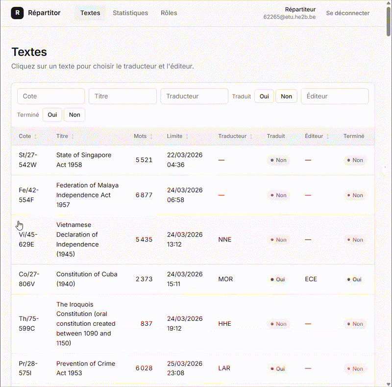
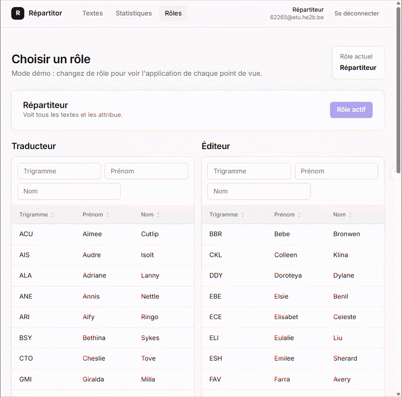
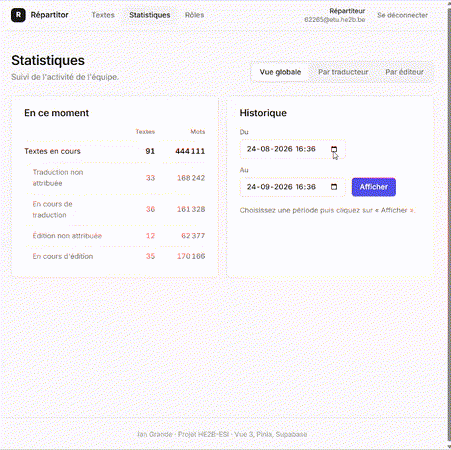
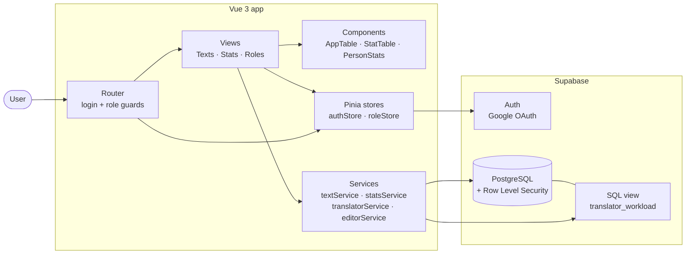
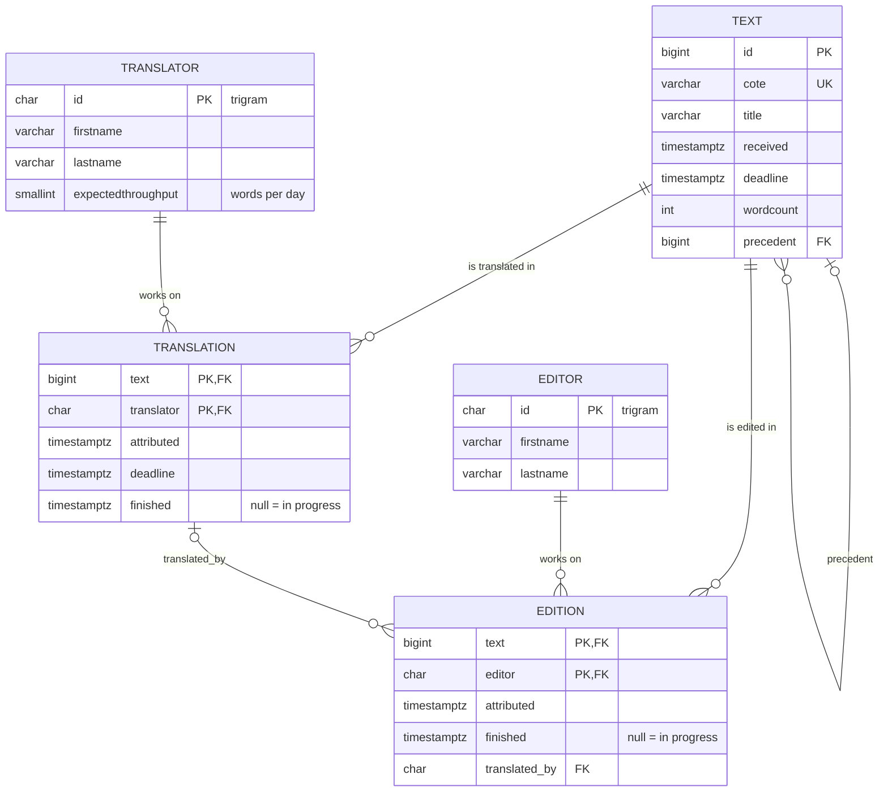

# Répartitor

Web app to share translation work in a team.
A **repartitor** gives each text to a **translator**, then to an **editor**.
Everybody can follow the progress, the deadlines and the workload.

> School project — HE2B-ESI (Brussels), web development course.
> The interface is in French.



## Features

- **Google login** with Supabase Auth
- **3 roles**, each with its own pages:
  - *Repartitor*: sees all texts, gives them to translators and editors, and sees the workload of each person before choosing (in work days)
  - *Translator*: sees their texts and personal deadlines, and marks a translation as finished
  - *Editor*: can finish an edition only when the translation is ready
- **Statistics**: current work and history on a chosen period (texts, words, late work), for the team or for one person
- Reusable table component with **sort and filters**
- Light and dark theme (follows the system setting)

## Screenshots

| Home page | Texts and attribution |
|-----------|-----------------------|
|  |  |

| Role switch | Statistics |
|-------------|------------|
|  |  |

## Tech stack

| Part      | Tool |
|-----------|------|
| Front-end | Vue 3 (Options API), Vue Router, Pinia |
| Back-end  | Supabase (PostgreSQL, Auth, Row Level Security) |
| Build     | Vite |
| Quality   | ESLint, Oxlint |

## Architecture



The views never call Supabase directly: they use the `services/` files.
This keeps the pages simple and the queries in one place.

## Data model



## Project structure

```
src/
├── components/   # reusable parts: AppTable, StatTable, StatusBadge, ...
├── views/        # one file per page (texts/, stats/)
├── services/     # all the Supabase queries
├── stores/       # Pinia stores: logged-in user and current role
├── router/       # routes and access rules for each role
└── utils/        # date and number helpers
resource/         # SQL: tables, views, security rules and demo data
docs/             # screenshots and demo GIFs
```

## Run it locally (optional)

The demo GIFs above show the full app. To run it yourself, you need your own
free Supabase project:

1. Create a Supabase project. Copy `.env.example` to `.env` and add the
   project URL and publishable key (Project Settings > API).
2. In the SQL Editor, run the files in `resource/` in this order:
   `repartitor-tables.sql`, `repartitor-views.sql`, then `seed.sql` (demo data).
3. Enable Google login: create an OAuth client in Google Cloud Console with
   the redirect URL `https://<your-project>.supabase.co/auth/v1/callback`,
   then add the client ID and secret in Supabase (Authentication > Providers > Google).
   Add `http://localhost:5173` in Authentication > URL Configuration.
4. Run `npm install` then `npm run dev`.

Other commands: `npm run build` (production build), `npm run lint`.

> **Note:** this setup is for local testing only. Do not deploy it publicly as it is:
> every logged-in user can read and change all the data (see "Limits and next steps").

## Limits and next steps

This is a school project, so some choices are simple on purpose:

- **Role switching is a demo feature.** Any logged-in user can choose a role on the
  "Rôles" page to test each point of view. In a real app, the role would be stored
  in the database and checked by Row Level Security policies.
- The current policies give full access to every logged-in user.
- Next steps: tests (Vitest), role-based RLS policies, pagination for big lists.

## Author

**Ian** - Student in Application Development at HE2B-ESI, Brussels

[LinkedIn](https://www.linkedin.com/in/ian-grande/) · [GitHub](https://github.com/ian-grande-dev) · [Email](mailto:ian.grande.pro@gmail.com)